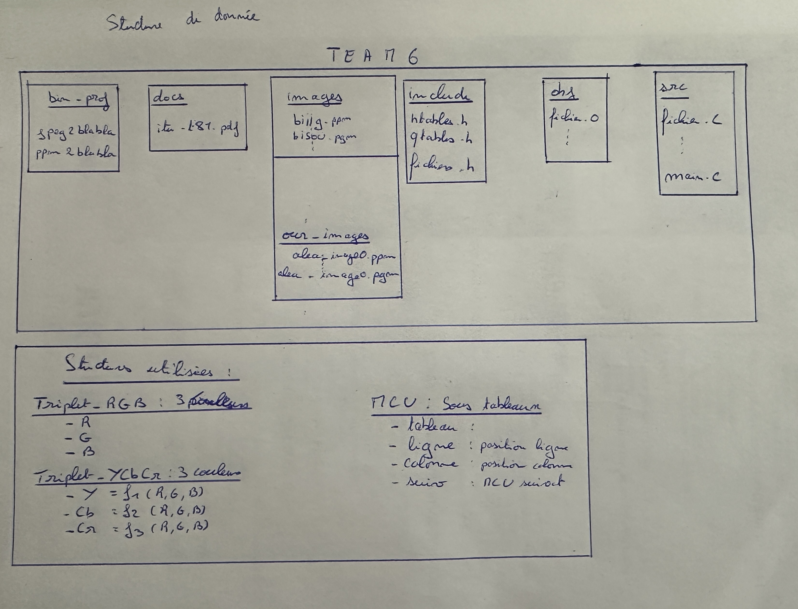
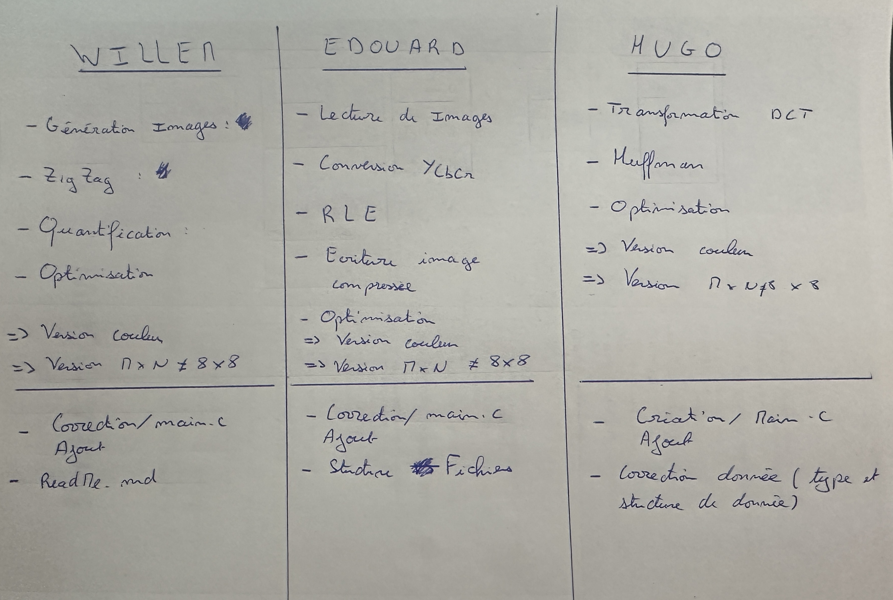

# Projet JPEG : 1A
## Team 6 :
## ADNET Willem, DA CRUZ Édouard, ZABIEGO Hugo

### Présentation: 

Nous vous présentons ici notre projet **JPEG** qui consiste à convertir une image sous format ppm/pgm en une image compressée sous format **JPEG**. Nous allons tout d'abord vous présenter les points suivants :   

1) Découpage des fonctionnalités du projet en module.
2) Structure de donnée du projet.
3) Répartition des tâches au sein de l'équipe.

Il sera alors présenter l'avancement à chque étape du projet.

### 1 : Le découpage des fonctionnalités du projet en module.

1) Module 1 : 
    1) Module 1.1 : Lecture des images **PPM/PGM**.
        1) Entrée : Chemin d'accès des images.
        2) Sortie : Images **PGM** ou **PPM** : matrice de taille **M × N** (**M** lignes et **N** colonnes).
    2) Module 1.2 : Génération des images **PGM** et **PPM**.
        1) Entrée : Nombre d'images à générer.
        2) Sortie : Images **PGM** ou **PPM** : matrice de taille **M × N**.
2) Module 2 : Conversion de l'image en **YCbCr**.
    1) Entrée : Image **PPM** ou **PGM** sous format **RGB**.
    2) Sortie : Image sous format **YCbCr** : matrice de taille **M × N**.
3) Module 3 : Sous-échantillonnage de l'image.
    1) Entrée : Image sous format **YCbCr**.
    2) Sortie : Image sous format **YCbCr** sous-échantillonnée sous le format : 
        * h1 × v1, h2 × v2, h3 × v3.
4) Module 4 : Transformation **DCT**.
    1) Entrée : Image sous format **YCbCr** : matrices d'entiers non signés sur 16 bits.
    2) Sortie : Image sous format **DCT** : matrices d'entiers signés.
5) Module 5 : ZigZag.
    1) Entrée : Image sous format **DCT**.
    2) Sortie : Image sous format **ZigZag** : Vecteur ligne d'entiers signés vecteur de taille : **MN**.
6) Module 6 : Quantification.
    1) Entrée : Image sous format **ZigZag** : Vecteur ligne.
    2) Sortie : Image sous format **ZigZag** : Vecteur quantifié mais avec le même format que précédement.
7) Module 7 : Encodage **RLE**.
    1) Entrée : Image sous format **ZigZag** : Vecteur quantifié.
    2) Sortie : Image sous format **RLE** : Compression des zéros.
8) Module 8 : Encodage **Huffman**.
    1) Entrée : Image sous format **RLE**.
    2) Sortie : Image sous format **Huffman** : Compression des pixels via le codage de Huffan préfixé.
9) Module 9 : Ecriture de l'image compressée.
    1) Entrée : Image sous format **Huffman**.
    2) Sortie : Image compressée sous format **JPEG**.
10) Module 10 : Optimisation de la compression **JPEG**.
    1) Entrée : Notre code de compression **JPEG**.
    2) Sortie : Image compressée sous format **JPEG** optimisée, plus rapidement et en utilisant moins d'espace mémoire.

### 2 : Structure de donnée du projet.

### 3 : Répartition des tâches au sein de l'équipe.

